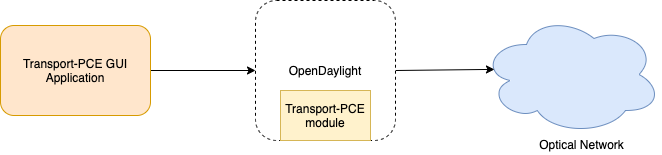

**Transport PCE GUI**
**Technical Architecture Document**

**Reference:**  N/A 
Approved by:
 
**Version:**  0.1 

**Edition date:**  16 Jan. 2020
 
**Responsible entity:** | Orange Labs NetworkOrange Labs Egypt

**Reference document(s):**  Transport-PCE GUI Requirements

**Authors:**  Ahmed Helmy 

**Document history**

| **Version** | **Author** | **Email** | **Date** | **Release Notes** |
| --- | --- | --- | --- | --- |
| 0.1 | Ahmed Helmy | [ahmad.helmy@orange.com](mailto:ahmad.helmy@orange.com) | 16 Jan. 2020 | second draft |

# Contents

[Executive Summary 3](#_Toc30041415)

[Document Understanding 3](#_Toc30041416)

[Functional Architecture 4](#_Toc30041417)

[Solution Description 4](#_Toc30041418)

[High-level solution features 4](#_Toc30041419)

[Technical architecture 5](#_Toc30041420)

[Software architecture diagram 6](#_Toc30041421)

[Interfaces 7](#_Toc30041422)

[Software 8](#_Toc30041423)

[Hardware components 9](#_Toc30041424)

# Executive Summary

## Document Understanding

Orange Labs Network had requested to develop a user interface for transport-PCE that helps in making demonstrations and promote the product, and provides more user-friendly interaction with the controller. In a Nutshell, the solution should visualize optical network nodes and the network layer. The solution should also provide an administration portal to allow network engineer(s) to view the network layer, view each node information based on its yang-tree model, and import postman collections and execute http requests. This will make it easy for the user to interact with the network elements from a single integrated dashboard.

This document provides an overview of the solution architecture. The ultimate goal of this solution is to retrieve network and service information from OpenDaylight APIs.

# Functional Architecture

## Solution Description

The proposed solution is an integrated solution that consists of one component to enable the users to visualize network topology nodes and view their details retrieved from OpenDaylight. This solution also enables nodes management through executing http requests on the nodes by import postman collections.

## High-level solution features

1. View Network topology Nodes:
  1. View Buildings &quot;CLLI&quot;
  2. View devices inside buildings such as Roadm, Xponder, and external pluggable device.
  3. View nodes inside devices such as: DEG, and SRG nodes inside Roadm.
  4. View links between two nodes, based on **OpenROADM-topology** layer
  5. View Node, Link information retrieved from OpenDaylight API.

1. Manage Node via Http Requests:
  1. Import postman collections with different collection versions
  2. Load all http request inside a specific collection.
  3. Execute specific http request and see the results

# Technical architecture

The solution is composed of two components:

1. Frontend, which is a single page application that serve the user interactions.
2. Backend that is responsible of serving the frontend requests and redirect these requests to fetch information from OpenDaylight + TransportPCE

Only VM that will host both backend and frontend components for the GUI application as they both are hosted in one container application.

Note: as per OpenDaylight Wiki: &quot;OpenDaylight is a highly available, modular, extensible, scalable and multi-protocol controller infrastructure built for SDN deployments on modern heterogeneous multi-vendor networks. OpenDaylight provides a model-driven service abstraction platform that allows users to write apps that easily work across a wide variety of hardware and south-bound protocols.&quot;

# Software architecture diagram

**Figure 1: application architecture**

## Interfaces

- **Number of users**

NA

## Software

| **Name** | **Version** | **Description** | **H/ware ref.** | **License Number** | **Notes** |
| --- | --- | --- | --- | --- | --- |
| **Operating system** |
|  |
| Linux Ubuntu Common bundle | 16.04 or higher |
 |
 |
 |
 |
| **Databases** |
| NA | | | | | No Database is required |
| **WAS, Web Servers** |
| Embedded tomcat via spring boot jar | | | | | JDK 11 |
| **Middleware and communications** |
| Spring boot, Angular| 2+, 8
 |
 |
 |
 |
 |
| **Development : Environment, tools, framework** |
| NPM, Gradle, IntellJ community, Visual Studio Code |
 | 
 |
 |
 |

 |

## Hardware components

Hardware requirements below are not set based on number of users nor hits as the project is not yet in production phase. Once the application is in production phase sections related to number of users, availability and hardware requirements need to be reviewed or added.

**Hardware**

| **Function** | **vCPU** | **RAM** |
| --- | --- | --- |
| Private VM1 for gui (TPCE\_GUI\_WEB) | 2 | 4GB |

**Disc space**

| **Description** | **Size (Gb)** | **H/ware ref.** | **Notes with version modifications** |
| --- | --- | --- | --- |
| **GUI Application, backups and Logs** | 50 GB |
 |
 |

&copy; Copyright Orange 2020
