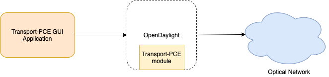

|
**Transport PCE GUI**
**Deployment Guide**

 **Version:** 0.1 
 
 **Edition date:**  16 Jan. 2020 
 
 **Responsible entity:**  Orange Labs NetworkOrange Labs Egypt
 
 **Reference document(s):** Transport-PCE GUI TAD 
 
**Authors:**  Reda El-Sayed, Ahmed Helmy 

**Document history**

| **Version** | **Author** | **Email** | **Date** | **Release Notes** |
| --- | --- | --- | --- | --- |
| 0.1 | Reda El-Sayed | Relsayed.ext@orange.com | 16 December 2019 | Initial Draft |
| 0.2 | Ahmed Helmy | [ahmad.helmy@orange.com](mailto:ahmad.helmy@orange.com) | 16 Jan. 2020 | Add document exec summary , architecture diagram and hardware |

# Contents

[Executive Summary 3](#_Toc30042928)

[Document Understanding 3](#_Toc30042929)

[Software architecture diagram 4](#_Toc30042930)

[Transport-CPE GUI Application 5](#_Toc30042932)

# Executive Summary

## Document Understanding

Orange Labs Network had requested to develop a user interface for transport-PCE that helps in making demonstrations and promote the product, and provides more user-friendly interaction with the controller. In a Nutshell, the solution should visualize optical network nodes and the network layer. The solution should also provide an administration portal to allow network engineer(s) to view the network layer, view each node information based on its yang-tree model, and import postman collections and execute http requests. This will make it easy for the user to interact with the network elements from a single integrated dashboard.

This document provides deployment guide to deploy Transport-PCE GUI application.

# Software architecture diagram

**Figure 1: application architecture**

**Deployment Steps**

Hardware requirements below are not set based on number of users nor hits as the project is not yet in production phase. Once the application is in production phase sections related to number of users, availability and hardware requirements need to be reviewed or added.

**Hardware**

| **Function** | **vCPU** | **RAM** |
| --- | --- | --- |
| Private VM1 for gui (TPCE\_GUI\_WEB) | 2 | 4GB |
| --- | --- | --- |

**Disc space**

| **Description** | **Size (Gb)** | **H/ware ref.** | **Notes with version modifications** |
| --- | --- | --- | --- |
| **GUI Application, backups and Logs** | 50 GB |
 |
 |
| --- | --- | --- | --- |

**Deployment Steps**

The following guideline describes how to deploy Transport-PCE GUI application.

### Transport-CPE GUI Application

**Prerequisite**

- Download and install java 1.8 to development and server machine from [here](https://www.oracle.com/technetwork/java/javase/downloads/jdk8-downloads-2133151.html)
- Download and install maven (3.6.2) to development machine from [here](https://maven.apache.org/)
- _First make sure you have the_ _TransportPCE_ _project up and runnig, and set the server url in_ _application.properties_ _files in_ **_network-url-path_** _,_ **_service-path-list_** _and_ **_service-url-path_** _properties._

**Installation steps**

- Clone GUI repo from [here](https://gitlab.forge.orange-labs.fr/tpce-gui/onap-tpce-manager.git/)
  - _git clone https://gitlab.com/Orange-OpenSource/lfn/odl/tpce\_gui.git_
- Navigate to the project folder
- Run the command below
  - _mvn clean package_
- Navigate to the folder _&quot;__ **${project\_Path}/ target** _&quot;
- Upload the jar file &quot;_ **onap-tpce-manager-0.0.1-SNAPSHOT.jar** _&quot; to the server VM.
- On Server VM, navigate the folder contains the jar file
- Run the command
  - _nohup java -jar onap-tpce-manager-0.0.1-SNAPSHOT.jar \&gt; nohup.log &amp;_

&copy; Copyright Orange 2020
